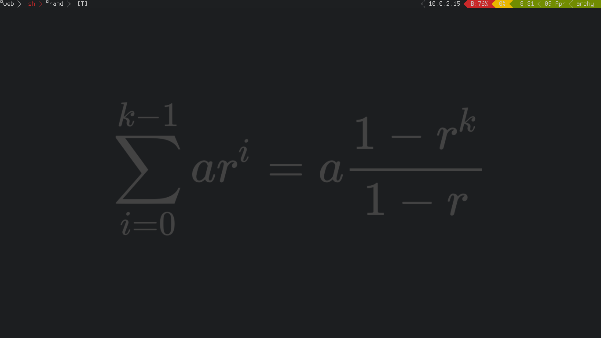

# dwm

Personal configuration of dwm.

## Installed Patches

- [xft](http://dwm.suckless.org/patches/xft) for xft font support.
- [pertag](http://dwm.suckless.org/patches/pertag) for sane tag management.
- [statuscolors](ihttp://dwm.suckless.org/patches/statuscolors) because
  whats life without colors.
- [single tagset](http://dwm.suckless.org/patches/single_tagset) for
  multi monitor support.

## Screen shot

I don't like it when people don't include screen shots, so I will include
one:

